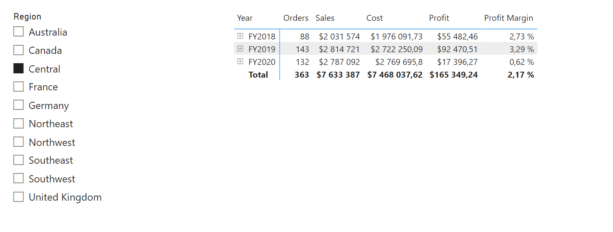
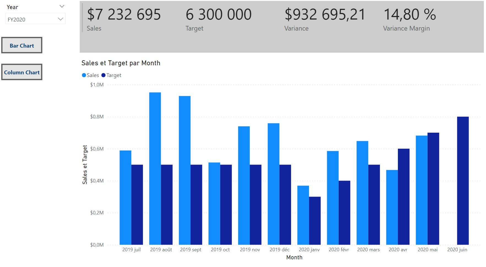
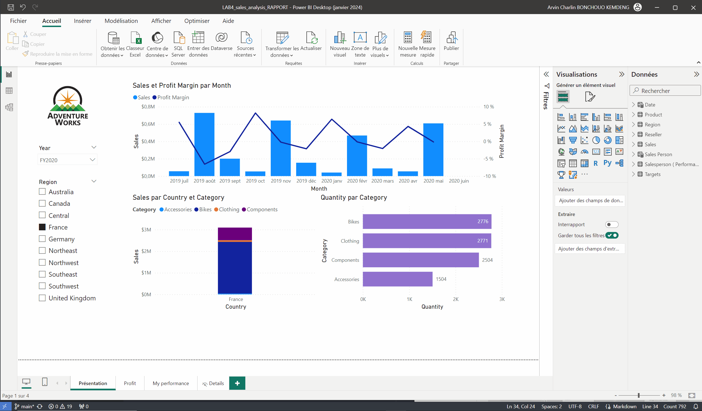

# PROJET Analysis VSC
 
## Table de matière
 
- [PROJET Analysis VSC](#projet-analysis-vsc)
  - [Table de matière](#table-de-matière)
  - [Introduction](#introduction)
  - [Modèle Tabulaire](#modèle-tabulaire)
  - [Excel](#excel)
  - [PBI](#pbi)
    - [Visuelle 1](#visuelle-1)
    - [Visuelle 2](#visuelle-2)
    - [Animation](#animation)
  - [Conclusion](#conclusion)
 
## Introduction
 
Ceci est un Projet **d'analyse** de donné avec SSAS, Excel et PowerBI basé sur la base de donné Contoso
 
## Modèle Tabulaire
 
## Excel
  Voici un visuel avec Excel

## PBI
Voici quelques visuels Power BI
### Visuelle 1
 
### Visuelle 2
 
 ### Animation
 
## Conclusion
Le but du projet est...